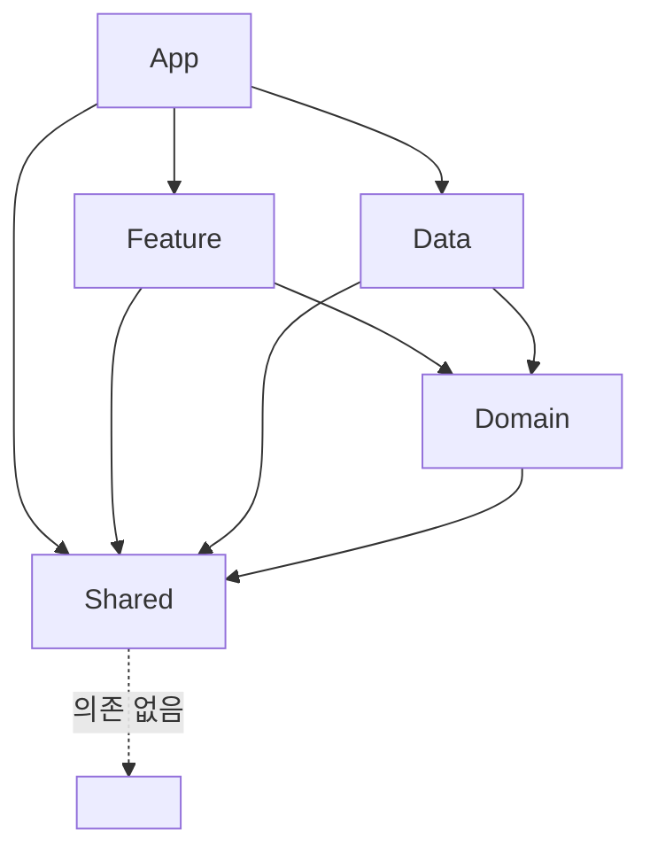

# ARCHITECTURE.md — 먹놀잠/찌뿌둥 iOS 아키텍처 설계

> 원칙(사용자 지정): ① 웹과 기능 동일 ② SwiftUI 네이티브 관용구 ③ 클린코드 + 모듈화(SPM/Tuist) 대비 폴더 경계 ④ 클린아키텍처(App/Feature/Domain/Data/Shared) ⑤ local-first.
> 데이터 스키마·동기화는 DATA_STRATEGY.md, 기능 명세는 PRODUCT_SPEC.md.

---

## 1. 레이어 정의와 의존성 규칙



의존성 방향은 항상 **안쪽(Domain)으로만** 향한다.

| 레이어 | 책임 | 알아도 되는 것 | **절대 몰라야 하는 것** |
|--------|------|----------------|------------------------|
| **Domain** | 순수 비즈니스: 엔티티(struct), Repository **프로토콜**(`async throws`), UseCase, 도메인 규칙(나이·수유간격·백분위 계산) | Foundation, Shared(순수 유틸) | SwiftUI, SwiftData, 네트워킹 구체타입, Feature |
| **Data** | Repository 프로토콜 **구현**. **HTTP(`APIClient`/`URLSession`)로 zzippu-api 호출, DTO ↔ Domain 엔티티 매핑**. Keychain(토큰). **서버가 진실의 원천**(server-first) | Domain(프로토콜/엔티티), Foundation/URLSession, Shared | SwiftUI, Feature |
| **Feature** | 화면 단위 UI(SwiftUI View) + ViewModel(@Observable). UseCase/Repository 프로토콜 호출(`await`) | Domain(프로토콜/엔티티/UseCase), Shared, SwiftUI | Data 구현체(오직 프로토콜만), 다른 Feature |
| **App** | 진입점, DI 컨테이너 조립(Composition Root), 라우팅. `APIClient` 생성·주입 | 전부(조립하므로) | — |
| **Shared** | 색상·타이포·공용 컴포넌트(BabyAvatar 등)·날짜 유틸·에러 타입 | Foundation, SwiftUI(디자인시스템만) | Domain/Data/Feature 도메인 지식 |

핵심 규칙(코드 리뷰 체크리스트):
- Feature는 **구체 Repository 타입을 import 하지 않는다**. 오직 `protocol FeedingRepository`(Domain)만 안다. 구현 주입은 App이 담당.
- Domain은 `import SwiftUI`/`import SwiftData` 금지. 네트워킹 **구체타입**(URLSession)도 금지 — 단 Repository 프로토콜 메서드는 `async throws`(서버 호출 대응). 이것이 미래 모듈화·테스트 용이성의 근간.
- **server-first 결정**: 데이터의 진실의 원천은 서버(zzippu-api). SwiftData는 도메인 저장소로 사용하지 않는다(오프라인 캐시는 후속 옵션 B). 상세는 `DATA_STRATEGY_SERVER_FIRST.md`.
- Feature 간 직접 의존 금지. 공유가 필요하면 Domain UseCase 또는 Shared로 올린다.

---

## 2. 전체 폴더 트리 (모듈화 대비 경계)

지금은 단일 Xcode 타깃이지만, **각 최상위 폴더가 훗날 SPM 패키지(또는 Tuist 모듈) 1개**가 되도록 경계짓는다. 폴더 = 미래 모듈. 폴더 간 import 규칙을 지키면 나중에 `Package.swift` 로 분리만 하면 된다.

```
zzippu/
├── App/                      # 미래 모듈: 앱 셸(조립만)
│   ├── zzippuApp.swift        # @main. ModelContainer + AppContainer 생성
│   ├── AppContainer.swift     # DI Composition Root (Repository 구현 주입)
│   ├── AppRootView.swift      # 세션 상태 기반 루트 분기(Auth/Terms/Onboarding/Main)
│   └── MainTabView.swift      # 하단 TabView
│
├── Feature/                  # 미래 모듈: 화면별 (UI + ViewModel). 각 하위폴더 = 서브모듈 후보
│   ├── Auth/
│   │   ├── LoginView.swift
│   │   ├── OtpView.swift
│   │   ├── TermsAgreementView.swift
│   │   └── AuthViewModel.swift
│   ├── Onboarding/           # BabyOnboardingView + ViewModel
│   ├── Home/                 # 기록 허브: BigActionGrid, QuickRepeatRow, ActiveSessionBanner, DayTimeline, RecordEditSheet
│   │   ├── HomeView.swift
│   │   ├── HomeViewModel.swift
│   │   └── Components/
│   ├── Feeding/              # FeedingInputSheet + FeedingViewModel
│   ├── Sleep/
│   ├── Diaper/
│   ├── Play/
│   ├── Growth/               # 리스트 + 성장곡선 차트(Swift Charts)
│   ├── Vaccination/
│   ├── Development/          # 발달 스테이지/이정표(읽기 전용)
│   ├── Dashboard/
│   ├── Trends/
│   ├── More/                 # 설정 허브 + 잠긴 후순위 항목
│   └── AI/                   # (후순위) Review/Chat/Saved/Youtube 세그먼트
│
├── Domain/                   # 미래 모듈: 순수(Foundation only). SwiftUI/SwiftData 금지
│   ├── Entities/             # struct: Baby, Feeding, SleepRecord, DiaperRecord, PlayRecord, GrowthRecord, Vaccination, DevelopmentStage, Milestone …
│   ├── Repositories/         # protocol만: FeedingRepository, SleepRepository, … + AuthRepository
│   ├── UseCases/             # SaveFeedingUseCase, ComputeDailySummaryUseCase, PredictNextFeedingUseCase, ComputeAgeUseCase, GrowthPercentileUseCase …
│   ├── Values/               # 열거형/값객체: FeedingType, DiaperType, StoolColor, StoolState, PlayType, SyncState
│   └── Errors/               # DomainError
│
├── Data/                     # 미래 모듈: Domain 구현 + 서버 통신
│   ├── Network/
│   │   ├── APIClient.swift   # 공용 HTTP(Bearer 주입, snake_case 코덱, 401 처리, 쓰기 재시도)
│   │   ├── DTOs/             # 서버 JSON 대응 struct: FeedingDTO, BabyDTO … (snake→camel 자동)
│   │   ├── DataSources/      # RemoteFeedingDataSource … (엔드포인트/스키마 아는 유일한 곳)
│   │   └── Mappers/          # DTO ↔ Entity 매핑 (FeedingDTO.toEntity())
│   ├── Repositories/         # RemoteFeedingRepository … (Domain 프로토콜 구현, DataSource+Mapper 조합)
│   ├── Auth/                 # AuthRemoteDataSource(URLSession), KeychainTokenStore, AuthRepositoryImpl
│   └── Content/              # 번들 정적 콘텐츠 로더(Development, Vaccination 프리셋)
│
└── Shared/                   # 미래 모듈: 순수 유틸 + 디자인시스템
    ├── DesignSystem/         # Color+Theme, Typography, Spacing, 공용 Button/Card 스타일
    ├── Components/           # BabyAvatar, EmptyStateView, DateNavigatorBar, UndoSnackbar
    ├── Extensions/           # Date+, Double+Format …
    └── Resources/            # development_stages.json, vaccination_schedule.json, Assets
```

이 경계의 배당금: 나중에 `swift package` 분리 시 Domain은 의존성 0으로 즉시 떨어져 나가고, Data/Feature도 이미 프로토콜로 결합돼 있어 순환참조가 없다.

---

## 3. 상태관리 결정 — **@Observable(Observation framework) 확정**

세 후보를 신생아앱 규모·클린아키텍처·SwiftData 통합·러닝커브·모듈화 관점에서 비교한다.

| 기준 | Combine | TCA(The Composable Architecture) | **@Observable (Observation)** |
|------|---------|----------------------------------|-------------------------------|
| 앱 규모 적합성 | 과함(수동 파이프라인) | 오버엔지니어링(중소 앱엔 보일러플레이트↑) | **딱 맞음** — 화면별 ViewModel 규모 |
| 클린아키텍처 | 가능하나 구독관리 복잡 | 강제되나 도메인이 TCA에 오염 | **Domain 순수 유지** — VM만 @Observable, Domain은 순수 struct |
| SwiftData 통합 | 수동 브리징 | reducer↔context 이질적, 마찰 | **1급 통합** — iOS17 SwiftData/Observation 동일 세대, `@Query`/`ModelContext` 자연스러움 |
| 러닝커브 | 중(연산자·메모리) | 높음(reducer/effect/dependency 사고전환) | **낮음** — 사용자(개발자 아빠)가 바로 생산적 |
| 모듈화 | 중립 | 라이브러리 강결합(전 모듈이 TCA 의존) | **경량** — 외부 의존 0, Feature 모듈만 SwiftUI+Observation |
| 토큰/유지보수 효율(사용자 선호) | 중 | 낮음(코드량 큼) | **높음** — 최소 코드 |

**결론:** `@Observable` (Observation framework) 로 확정.
- 근거: (1) iOS 17.5 타깃이라 Observation·SwiftData가 같은 세대로 마찰 없이 붙는다. (2) 신생아앱은 화면별 상태가 지역적이라 TCA의 전역 스토어/reducer가 이득보다 비용이 크다. (3) Domain을 어떤 프레임워크에도 오염시키지 않아 클린아키텍처·모듈화·테스트가 유리하다. (4) 외부 의존 0으로 빌드/토큰 효율이 좋다.
- 적용: 각 Feature는 `@Observable final class XxxViewModel`. View는 `@State private var vm`(소유) 또는 `@Environment`(공유) 로 받는다. 도메인 이벤트 스트림이 필요한 극소수 지점(예: 활성 수면 세션 경과 타이머)만 `Timer`/`AsyncStream` 로 처리하고 Combine은 도입하지 않는다.
- SwiftData 사용 지침: 리스트/타임라인 등 **읽기 화면은 `@Query`를 View에서 직접 쓰지 않는다**(클린아키텍처 경계 유지). 대신 ViewModel이 Repository(프로토콜)를 통해 조회한 **Domain 엔티티 배열**을 `@Observable` 프로퍼티로 노출한다. `@Query`는 Data 레이어 내부 최적화로만 허용.

---

## 4. 의존성 주입(DI)

**환경 기반 컨테이너(Composition Root at App)** 채택. 외부 DI 라이브러리 없음.

- `AppContainer`(App 레이어)가 앱 시작 시 모든 구체 Repository를 생성·보관한다.
  ```swift
  @Observable final class AppContainer {
      let feedingRepository: FeedingRepository   // 프로토콜 타입으로 보관
      let babyRepository: BabyRepository
      let growthRepository: GrowthRepository
      let authRepository: AuthRepository
      // …
      init() {
          let api = APIClient(tokenProvider: { KeychainTokenStore().load() },
                              onUnauthorized: { /* signOut + session=nil */ })
          self.feedingRepository = RemoteFeedingRepository(api: api)
          self.babyRepository    = RemoteBabyRepository(api: api)
          self.growthRepository  = RemoteGrowthRepository(api: api)
          self.authRepository    = AuthRepositoryImpl(remote: AuthRemoteDataSource(),
                                                      tokenStore: KeychainTokenStore())
          // …
      }
  }
  ```
- 주입 경로: `App`에서 `.environment(container)` → 각 View가 `@Environment(AppContainer.self) var container` 로 꺼내 **해당 화면 ViewModel을 생성**할 때 프로토콜 의존성을 넘긴다.
  ```swift
  struct FeedingInputSheet: View {
      @Environment(AppContainer.self) private var container
      @State private var vm: FeedingViewModel?
      var body: some View {
          content.task {
              if vm == nil { vm = FeedingViewModel(repository: container.feedingRepository, babyId: container.activeBabyId) }
          }
      }
  }
  ```
- 테스트: ViewModel은 프로토콜만 알므로 `MockFeedingRepository` 주입으로 UI 없이 단위 테스트.
- 프리뷰: `AppContainer.preview`(**Mock 리포지토리 = 메모리 배열**, 네트워크 미접속) 정적 팩토리 제공.

### Repository 패턴 (Domain 프로토콜 ← Data Remote(HTTP) 구현)
- 프로토콜은 **Domain/Repositories** 에 위치(엔티티=struct 기준 시그니처, **`async throws`**). 예:
  ```swift
  // Domain — 프레임워크 무지 (구체 네트워킹 타입 모름)
  protocol FeedingRepository {
      func create(_ feeding: Feeding) async throws -> Feeding
      func update(_ feeding: Feeding) async throws -> Feeding
      func delete(id: UUID, babyId: UUID) async throws       // 서버 물리삭제(204)
      func list(babyId: UUID, on day: Date) async throws -> [Feeding]
      func lastFeeding(babyId: UUID) async throws -> Feeding?
  }
  ```
- 구현은 **Data/Repositories** 의 `RemoteFeedingRepository` = `RemoteFeedingDataSource`(HTTP) + Mapper(DTO↔Entity). (엔드포인트·스키마·전략 상세는 `DATA_STRATEGY_SERVER_FIRST.md` §1~5, 전환 절차는 `MIGRATION_PLAN.md`.)

---

## 5. 아키텍처 관련 결정 요약
1. 상태관리 = **@Observable**(TCA·Combine 미채택). 근거는 §3.
2. DI = **환경 기반 Composition Root**(무외부의존). Feature는 프로토콜만 의존.
3. Repository 프로토콜은 **Domain**(`async throws`), 구현은 **Data(Remote/HTTP)**. **서버(zzippu-api)가 진실의 원천**(server-first). 부부 공유는 caregiver 초대코드. 오프라인은 낙관적 업데이트+재시도(MVP), 로컬캐시는 후속. 상세 `DATA_STRATEGY_SERVER_FIRST.md`.
4. 폴더 = 미래 SPM/Tuist 모듈. import 방향 규칙을 CI/리뷰로 강제.
5. SwiftUI 네이티브 관용구(TabView, sheet, Swift Charts, SF Symbols, `.searchable`/스낵바 등)를 쓰되 웹 화면을 픽셀 모방하지 않는다.
